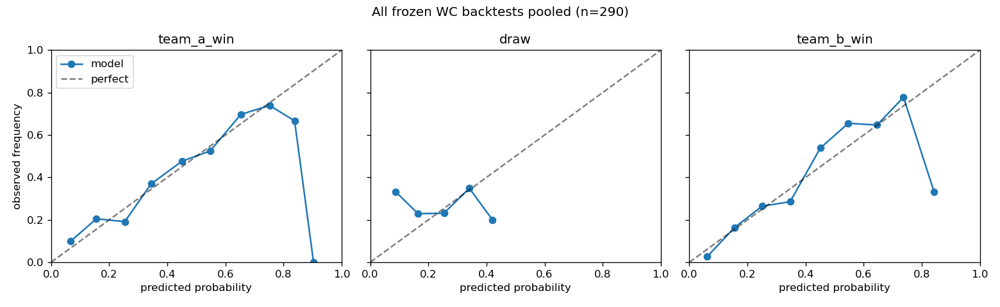
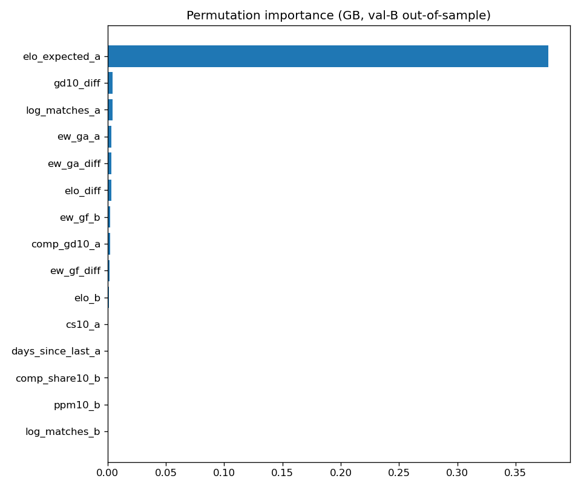

# International Soccer Predictor — 2026 World Cup

A reproducible, leakage-safe statistical/ML pipeline that predicts senior
men's international football matches:

* win / draw / win probabilities **after 90 minutes** (always sum to 1)
* expected goals for both teams and exact-scoreline probabilities
* both-teams-to-score, over/under 2.5, clean sheets, first scorer
* for knockouts: advancement, extra-time, and penalty-shootout probabilities
* a confidence label and the most influential features per match

Probabilities come from trained models — a custom Elo, a Poisson goal model,
multinomial logistic regression, and gradient boosting, blended by a
validation-selected ensemble. Nothing is hand-tuned to look impressive, and
results on past World Cups are reported honestly (they are humbling —
football is random).

**Free everything**: public datasets, open-source Python, no API keys, runs
locally in a couple of minutes.

---

<!-- WC2026-PREDICTIONS:START -->
<a id="next-round"></a>

## 🔮 Next round: Match for third place & Final — model predictions

_Auto-generated by `python update_readme.py` — do not edit this section by hand._

Generated **2026-07-16T07:54:24Z** · model **v0.2.0** (rolling mode) · features through **2026-07-15**. Win/draw/win refers to the score after 90 minutes and sums to 1; advancement includes extra time and penalties. Every prediction is also stored in the append-only [prediction log](reports/predictions/world_cup_2026_predictions.csv).

### 🇫🇷 France vs 🏴󠁧󠁢󠁥󠁮󠁧󠁿 England

**Match for third place · Sat 18 Jul 2026 · 21:00 UTC · Miami (Miami Gardens)**

| Result after 90 minutes | Probability | |
|:--|--:|:--|
| **France** win | **39.1%** | `█████████░░░░░░░░░░░░░` |
| Draw | **34.3%** | `████████░░░░░░░░░░░░░░` |
| **England** win | **26.6%** | `██████░░░░░░░░░░░░░░░░` |

**Expected goals:** France **1.41** · England **1.17** &nbsp;&nbsp;|&nbsp;&nbsp; **Most likely score:** 1–1

| Top scorelines | Probability |
|:--|--:|
| 1–1 | 16.3% |
| 0–0 | 10.0% |
| 1–0 | 9.6% |
| 2–1 | 8.2% |
| 0–1 | 7.4% |

| Goals market | Probability |
|:--|--:|
| Both teams to score | 54.3% |
| Over 2.5 goals | 45.2% |
| Under 2.5 goals | 54.8% |
| France clean sheet | 31.5% |
| England clean sheet | 24.3% |
| France scores first | 49.2% |
| England scores first | 40.8% |

| Advancement (incl. extra time & penalties) | Probability | |
|:--|--:|:--|
| **France advance** | **57.3%** | `█████████████░░░░░░░░░` |
| **England advance** | **42.7%** | `█████████░░░░░░░░░░░░░` |
| Extra time | 34.3% | |
| Penalty shootout | 18.5% | |

_Model confidence: **high** (74/100)_

---

### 🇪🇸 Spain vs 🇦🇷 Argentina

**Final · Sun 19 Jul 2026 · 19:00 UTC · New York/New Jersey (East Rutherford)**

| Result after 90 minutes | Probability | |
|:--|--:|:--|
| **Spain** win | **36.8%** | `████████░░░░░░░░░░░░░░` |
| Draw | **35.3%** | `████████░░░░░░░░░░░░░░` |
| **Argentina** win | **27.9%** | `██████░░░░░░░░░░░░░░░░` |

**Expected goals:** Spain **1.36** · Argentina **1.12** &nbsp;&nbsp;|&nbsp;&nbsp; **Most likely score:** 1–1

| Top scorelines | Probability |
|:--|--:|
| 1–1 | 16.8% |
| 0–0 | 11.1% |
| 1–0 | 9.7% |
| 0–1 | 8.2% |
| 2–1 | 7.6% |

| Goals market | Probability |
|:--|--:|
| Both teams to score | 52.5% |
| Over 2.5 goals | 42.7% |
| Under 2.5 goals | 57.3% |
| Spain clean sheet | 32.0% |
| Argentina clean sheet | 26.6% |
| Spain scores first | 48.8% |
| Argentina scores first | 40.2% |

| Advancement (incl. extra time & penalties) | Probability | |
|:--|--:|:--|
| **Spain advance** | **55.5%** | `████████████░░░░░░░░░░` |
| **Argentina advance** | **44.5%** | `██████████░░░░░░░░░░░░` |
| Extra time | 35.3% | |
| Penalty shootout | 19.4% | |

_Model confidence: **high** (71/100)_

<!-- WC2026-PREDICTIONS:END -->

---

## Contents

- [Next round: model predictions](#next-round)
- [Quick start](#quick-start)
- [What the commands do](#what-the-commands-do)
- [Frozen vs rolling mode](#frozen-vs-rolling-mode)
- [Rules of the road — read before you experiment](#rules-of-the-road--read-before-you-experiment)
- [Understanding the output](#understanding-the-output)
- [How it works](#how-it-works)
- [Results](#results)
- [Data sources](#data-sources)
- [Project layout](#project-layout)
- [Extending the model](#extending-the-model)
- [Troubleshooting](#troubleshooting)
- [Disclaimer](#disclaimer)

---

## Quick start

Requires **Python 3.10+**.

```bash
git clone <this-repo> && cd <this-repo>
pip install -r requirements.txt         # or: conda env create -f environment.yml

# 1) Download data (~4 MB from public GitHub repos, cached under data/raw)
python update_data.py --include-world-cup-2026

# 2) Train a model bundle (~2-4 minutes on a laptop)
python train.py --cutoff "2026-07-11"

# 3) Predict a match
python predict.py --team-a "Argentina" --team-b "France" \
    --date "2026-07-15T20:00:00Z" --competition "FIFA World Cup" \
    --stage knockout --neutral --mode rolling
```

You get a console report plus a machine-readable JSON block. Run the tests
any time with `python -m pytest tests/ -q` (58 tests, a few seconds).

There is also a tournament-level view — each remaining team's probability
of winning the 2026 World Cup:

```bash
python simulate_tournament.py --mode rolling
```

## What the commands do

### `update_data.py` — refresh the dataset

```bash
python update_data.py --include-world-cup-2026   # recommended form
python update_data.py --offline                  # rebuild from cached raw files
```

Downloads the raw sources, rebuilds the canonical match table
(`data/processed/matches.csv`), prints a **freshness report** (latest match
in the dataset, latest completed 2026 WC match, etc.), and — with
`--include-world-cup-2026` — cross-verifies every completed 2026 result
between two independent sources. Rebuilds are idempotent: re-running can
never create duplicate matches.

Run this before predicting anything current. The source data is typically
updated within a day of matches finishing.

### `train.py` — train a model bundle

```bash
python train.py --cutoff "2026-06-11"    # pre-tournament model (frozen 2026)
python train.py --cutoff "2026-07-11"    # model trained on everything so far
```

Trains all components on matches **strictly before** the cutoff, selects
ensemble weights and calibration on a chronological validation window (also
entirely before the cutoff), and saves a self-contained bundle to
`models/bundle_<cutoff>.joblib` plus a copy at `models/bundle_latest.joblib`.
Each bundle stores its models, weights, config snapshot, training cutoff,
and package versions — same data + config reproduce the same predictions.

### `predict.py` — predict any two national teams

```bash
python predict.py --team-a "Spain" --team-b "England" \
    --date "2026-07-14T20:00:00Z" \
    --competition "FIFA World Cup" --stage knockout --neutral \
    --mode rolling [--update-data] [--json-only] [--no-log]
```

| flag | meaning |
|---|---|
| `--date` | kickoff, ISO date or timestamp (UTC) |
| `--competition` | e.g. `"FIFA World Cup"`, `"Friendly"`, `"UEFA Nations League"` — sets match importance |
| `--stage knockout` | enables advancement / extra-time / shootout outputs |
| `--neutral` / `--home-team-a` | venue; neutral is the default |
| `--mode` | `rolling` (default) or `frozen` — see below |
| `--cutoff` | prediction cutoff if earlier than kickoff (features use matches strictly before this day) |
| `--update-data` | refresh the dataset first |
| `--json-only` | suppress the console report |
| `--no-log` | don't append to the 2026 prediction log |

Team names follow the dataset's conventions (`United States`, `South Korea`,
`Ivory Coast`, `Turkey`...). Common variants (`USA`, `Korea Republic`,
`Côte d'Ivoire`, `Türkiye`) resolve automatically; anything unknown gets
close-match suggestions instead of a wrong guess.

### `update_readme.py` — publish next-round predictions to this README

```bash
python update_readme.py [--mode rolling|frozen] [--dry-run] [--update-data]
```

Regenerates the [Next round](#next-round) section at the top of this file.
It auto-detects the upcoming round from the cached openfootball fixtures
(unplayed matches whose team slots are decided — `W101`-style placeholders
wait until the previous round finishes) and renders the trained bundle's
predictions between the `WC2026-PREDICTIONS` markers. The numbers are the
same deterministic outputs `predict.py` produces; nothing is written to the
append-only prediction log. Typical cadence after each round completes:

```bash
python update_data.py --include-world-cup-2026 && python update_readme.py
```

This also runs unattended: a scheduled GitHub Action
([`update-predictions.yml`](.github/workflows/update-predictions.yml)) does
the above twice a day and commits the refreshed section when predictions
actually change (timestamp-only rewrites are skipped). Model binaries are
not committed, so the action reproduces the locked bundle from its pinned
training cutoff — fixed seeds and a stable pre-cutoff dataset make that a
deterministic build step, not a mid-tournament retune.

### `simulate_tournament.py` — forecast the rest of the 2026 bracket

```bash
python simulate_tournament.py --mode rolling            # who wins from here?
python simulate_tournament.py --mode frozen \
    --model models/bundle_2026_frozen.joblib            # pre-tournament view
```

Reads the remaining knockout fixtures from the cached openfootball file,
resolves `W99`-style slot references through the bracket, and propagates the
model's pairwise advancement probabilities by **exact enumeration** (no
Monte Carlo noise) into each team's probability of reaching the semi-final
and final, finishing third, and winning the World Cup. Every pairwise
probability is exactly what `predict.py` would report for that fixture.

Documented approximation: features are frozen at the forecast cutoff, so a
hypothetical earlier upset does not update Elo/form for later rounds within
a simulated path. Forecasts are saved under `reports/predictions/`
(timestamped JSON plus an append-only per-team CSV log).

### `backtest.py` — evaluate honestly

```bash
python backtest.py --validate                     # expanding-window folds 2014-2025
python backtest.py --year 2022 --mode both        # frozen + rolling WC backtest
```

Writes metric reports and per-match predictions under `reports/backtests/`
and reliability/goal-diagnostic figures under `reports/figures/`.

## Frozen vs rolling mode

* **Frozen** — features (Elo, form, rest days) stop at the tournament start.
  Measures pure pre-tournament forecasting: "what did we know before a ball
  was kicked?" Use `--mode frozen --model models/bundle_2026_frozen.joblib`.
* **Rolling** — completed tournament matches update the *features* for later
  match-days, but the model, hyperparameters, and ensemble weights stay
  locked. This is the mode you want during the tournament.

Both modes are backtested and reported separately — rolling is *not*
automatically better (it won 2014/2018, lost 2022/2026-so-far; see
[Results](#results)).

## Rules of the road — read before you experiment

These aren't style preferences; each one protects the statistical validity
of the predictions.

1. **Don't retrain during a tournament you're predicting.**
   `train.py` reselects ensemble weights on recent data. Run mid-tournament,
   that means weights chosen on tournament matches — a form of leakage, and
   your frozen/rolling comparison becomes meaningless. Train once before the
   tournament (or accept that your bundle is "locked" at whatever cutoff you
   chose) and let **rolling mode** handle new results: features update from
   the dataset at prediction time, no retraining needed.

2. **Keep `models/bundle_2026_frozen.joblib`.** It's the only bundle whose
   training provably predates the 2026 World Cup. If you overwrite it, you
   can't make honest frozen-mode predictions anymore (you'd have to wait for
   the next tournament).

3. **Never edit `reports/predictions/world_cup_2026_predictions.csv`.**
   It's append-only by design. A prediction log you can rewrite after
   results are known is worthless.

4. **Check the freshness report before trusting a prediction.** If
   `latest_match_in_dataset` is older than the teams' last matches, run
   `update_data.py` first. The CLI warns on stale data but won't stop you.

5. **Dates are day-granular.** The dataset has no kickoff times, so a match
   on day D uses only matches from day D−1 and earlier. Two matches on the
   same day never inform each other. Predicting tonight's game means
   "knowing" results only through yesterday.

6. **If you tweak the model, validate chronologically** —
   `python backtest.py --validate` — and keep a change only if it improves
   held-out log loss / Brier / RPS. Random train/test splits on match data
   will lie to you (future matches leak into training). And never tune on
   the World Cup you plan to evaluate: hyperparameters here were tuned on
   folds ≤ 2013 for exactly this reason.

7. **Don't read too much into any single match or tournament.** 64–98
   matches is a small sample; judge changes on the pooled metrics.

## Understanding the output

Console report plus JSON. Key JSON fields:

```
outcome_90            # P(team A win / draw / team B win) after 90 minutes — sums to 1
expected_goals        # Poisson model's lambda for each team
scorelines            # top exact scores with probabilities (consistent with outcome_90)
additional_probabilities  # BTTS, over/under 2.5, clean sheets, first scorer
knockout              # advancement, extra time, penalty shootout (knockout only)
confidence            # label + 0-100 score from model agreement, entropy,
                      # history depth, feature completeness (a documented
                      # heuristic — high win probability != high confidence)
important_features    # top-5 model-derived feature contributions
component_probabilities  # each model's raw view, so you can see disagreement
model_information     # training cutoff, feature cutoff, ensemble weights, versions
```

All "win/draw" probabilities refer to the score after 90 minutes plus
stoppage time — extra time and shootouts are reported only in `knockout`.

## How it works

1. **Canonical dataset** — 49k+ internationals (1872→present) from public
   sources, with regulation / extra-time / shootout goals kept strictly
   separate. World Cup ET-decided matches are corrected to their true
   90-minute draws using a second source with FT/ET/pens splits.
2. **Chronological features** — custom Elo (competition-weighted K, goal
   margin, home advantage, inactivity decay) + rolling form windows
   (5/10/20 matches, competitive-only variants, exponential day-decay) +
   match context. Built in a single time-ordered pass: features for day D
   are emitted before day D's results update anything, so leakage is
   structurally impossible (and tested: `tests/test_no_leakage.py`).
3. **Models** — Elo-probability logistic, team-rows Poisson (→ exact-score
   matrix), multinomial logistic regression, and sklearn
   HistGradientBoosting, all symmetrized so team order doesn't matter.
   The score matrix carries a Dixon-Coles low-score correction whose rho is
   estimated on the training window and **kept only when it improves an
   unseen chronological window** — the gate decides per training cutoff
   (kept at the 2026 cutoffs with rho ≈ −0.022; dropped e.g. at the 2022
   cutoff, reproducing the uncorrected model exactly).
4. **Ensemble & calibration** — nonnegative weights summing to 1, grid-
   searched on a pre-cutoff validation window; multinomial recalibration is
   kept only if it improves a later held-out window (it currently doesn't,
   so it's off).
5. **Knockout layer** — P(extra time) = P(draw at 90'); ET goals at
   historically-calibrated reduced rates; shootouts ≈ 50/50 with a small
   Elo tilt clipped to [0.45, 0.55].

## Results

All numbers on chronologically unseen data. Full tables, per-match
predictions, and figures: [reports/RESULTS.md](reports/RESULTS.md).

**Expanding-window folds 2014–2025** (train through Y−1, validate on Y, mean):

| model | log loss | accuracy |
|---|---|---|
| logistic (full features) | **0.8825** | 59.2% |
| gradient boosting | 0.8851 | 59.1% |
| Elo only | 0.8974 | 59.1% |
| Poisson only | 0.8991 | 58.7% |
| higher-Elo baseline | 0.9555 | 59.1% |
| class-frequency baseline | 1.0542 | 47.3% |

**World Cup backtests** (model trained strictly pre-tournament):

| World Cup | frozen log loss | rolling log loss | frozen accuracy |
|---|---|---|---|
| 2014 | 0.9996 | 0.9724 | 51.6% |
| 2018 | 0.9881 | 0.9763 | 54.7% |
| 2022 | 1.0599 | 1.0795 | 54.7% |
| 2026 (98 matches so far) | 0.8895 | 0.9012 | 65.3% |

Pooled frozen calibration across all four tournaments (290 matches,
ECE 0.054):



What drives predictions (out-of-sample permutation importance):



## Data sources

This repo **does not redistribute data** — the pipeline downloads at runtime
and caches locally (`data/` is gitignored). Sources, each under its own
terms:

| Source | Role |
|---|---|
| [martj42/international_results](https://github.com/martj42/international_results) | primary results, 1872→present, incl. 2026 WC |
| [openfootball/worldcup.json](https://github.com/openfootball/worldcup.json) | FT/ET/pens splits + stages for World Cups 2010–2026; 2026 cross-verification |

Retrieval metadata (URL, timestamp, size) is recorded next to every cached
file and in `data/metadata/data_audit.json`. No betting odds are used
anywhere.

## Project layout

```
config/default.yaml     all tunable parameters (documented)
update_data.py          download + canonical dataset + freshness report
train.py                train a bundle through a cutoff
predict.py              predict any fixture
simulate_tournament.py  remaining-bracket forecast (champion probabilities)
backtest.py             chronological validation + WC backtests
src/data/               download, cleaning, team names, 2026 workflow
src/features/           Elo, rolling form, chronological feature builder
src/models/             baselines, Poisson (+ Dixon-Coles), classifiers, ensemble
src/evaluation/         metrics, backtests, tuning (dev-years only)
src/prediction/         score matrix, knockout staging, match + bracket predictors
tests/                  53 tests incl. leakage & extra-time guarantees
reports/                results, backtests, figures, append-only prediction log
notebooks/              thin display notebooks (logic lives in src/)
```

## Extending the model

Ideas and where they go:

* new features → `src/features/` (must be computable strictly pre-match;
  wire into `FeatureBuilder.fixture_row`)
* FIFA rankings → `src/features/rankings.py` (stub with the cutoff rule
  documented)
* new models → `src/models/`, add to `COMPONENT_NAMES` in `train_pipeline.py`
* group-stage simulation (advancement from group context) →
  `src/prediction/simulate_tournament.py` currently starts at the bracket

The gate for *any* change: `python backtest.py --validate` must improve.
See "Rules of the road" #6.

## Troubleshooting

* **`No trained model at models/bundle_latest.joblib`** — run `train.py`
  (models are not committed; they're built locally in minutes).
* **`Unknown team 'X'. Did you mean: ...`** — use a suggested name; the
  dataset's naming conventions are listed above.
* **Network errors** — the pipeline falls back to cached raw files with a
  warning; `--offline` forces that. First-ever run needs internet once.
* **Predictions look stale** — read the freshness report; run
  `update_data.py`.
* **Different sklearn version warnings when loading a bundle** — retrain
  rather than trusting a bundle across major sklearn versions.

## Disclaimer

This is a statistics hobby project for educational use. Probabilities are
model estimates with real uncertainty — football is genuinely random (the
best public models top out around 55–60% accuracy on World Cup matches).
**Not betting advice; don't wager money based on this.**

## License

MIT (see [LICENSE](LICENSE)). Downloaded data remains under its sources'
own terms.
